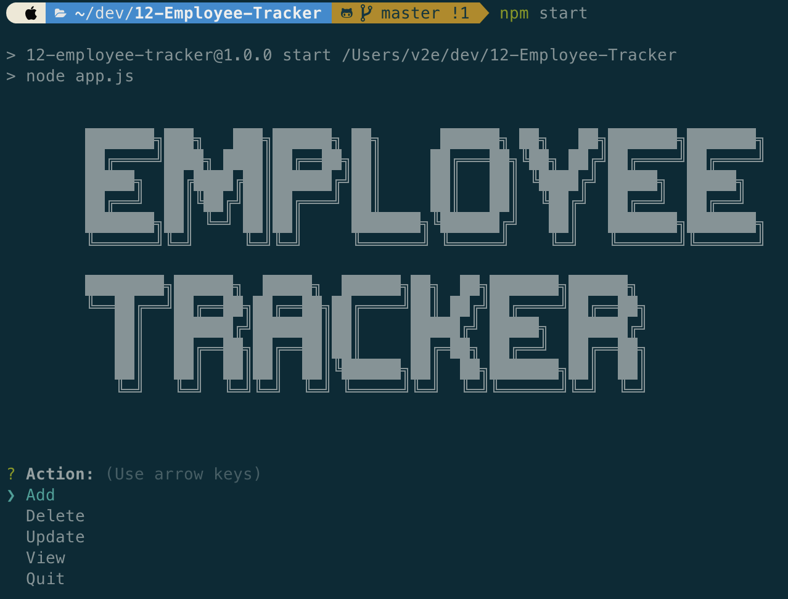

# 12-Employee-Tracker


## Description

To architect and build a solution for managing a company's employees using node, inquirer, and MySQL.

Please visit this [YouTube](https://www.youtube.com/watch?v=MVoOQmg8qLo) Link to seethe entirety of the app's functionality

```
As a business owner
I want to be able to view and manage the departments, roles, and employees in my company
So that I can organize and plan my business
```



## Table of Contents

-   [Installation](#Installation)
-   [Usage](#Usage)
-   [License](#License)
-   [Contributing](#Contributing)
-   [Tests](#Tests)
-   [Questions](#Questions)

## Installation

To install necessary dependencies, run the following command:

```
npm i
```

## Usage

To start the app, run the following command:

```
npm start
```

-   Add departments, roles, employees

-   View departments, roles, employees

-   Update employee roles

-   Update employee managers

-   View employees by manager

-   Delete departments, roles, and employees

-   View the total utilized budget of a department -- ie the combined salaries of all employees in that department

## License

This project is licensed under the MIT.

## Contributing

The app is contributed by Vulgarity2Elegance. If you want to contribute to this project, please see [Questions](#Questions).

## Questions

If you have any questions about the repo, open an issue or contact me directly at jyzhu0101@gmail.com.

You can find more of my work at [Vulgarity2Elegance](https://github.com/Vulgarity2Elegance).
